# PES-VCS Lab Report
**Name:** Bharat
**SRN:** PES1UG24CS113

## Phase 1 Screenshots
### 1A - test_objects passing
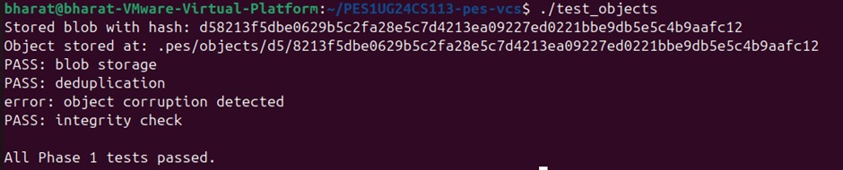

### 1B - Sharded object directory
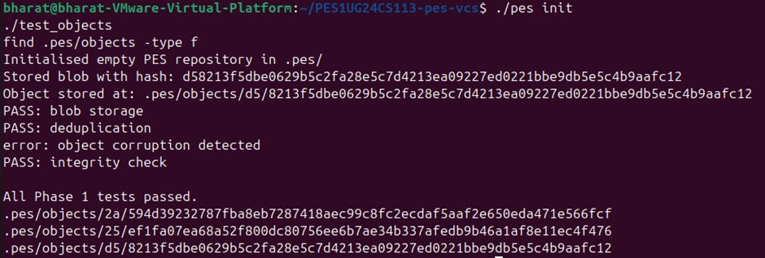

## Phase 2 Screenshots
### 2A - test_tree passing
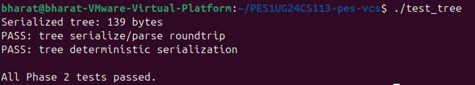

### 2B - Raw binary tree object
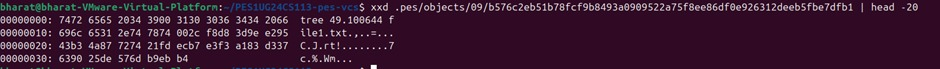

## Phase 3 Screenshots
### 3A - pes init → add → status
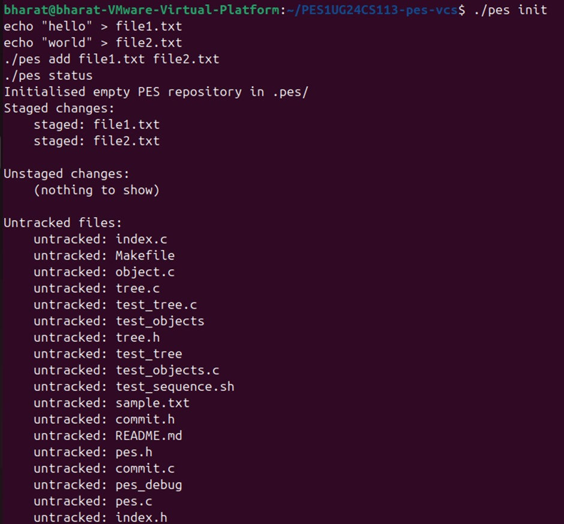

### 3B - cat .pes/index
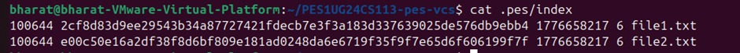

## Phase 4 Screenshots
### 4A - pes log
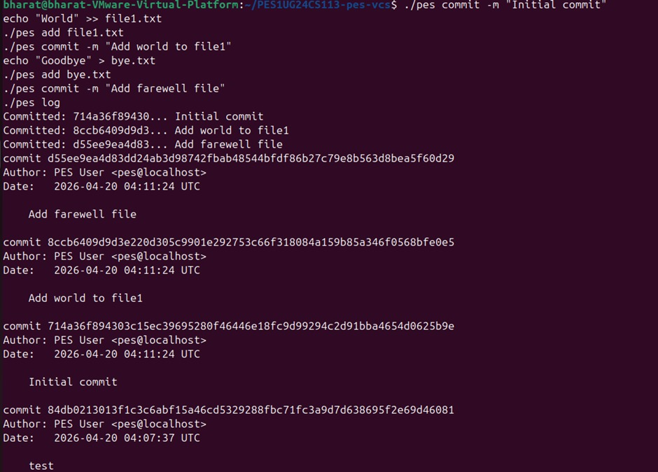

### 4B - find .pes -type f
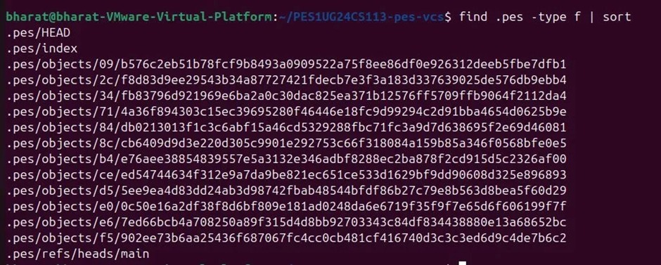

### 4C - HEAD and refs/heads/main
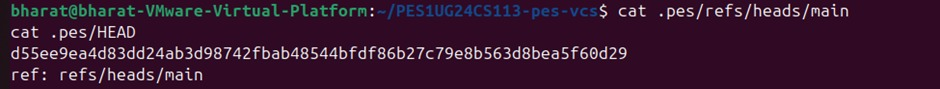

## Integration Test
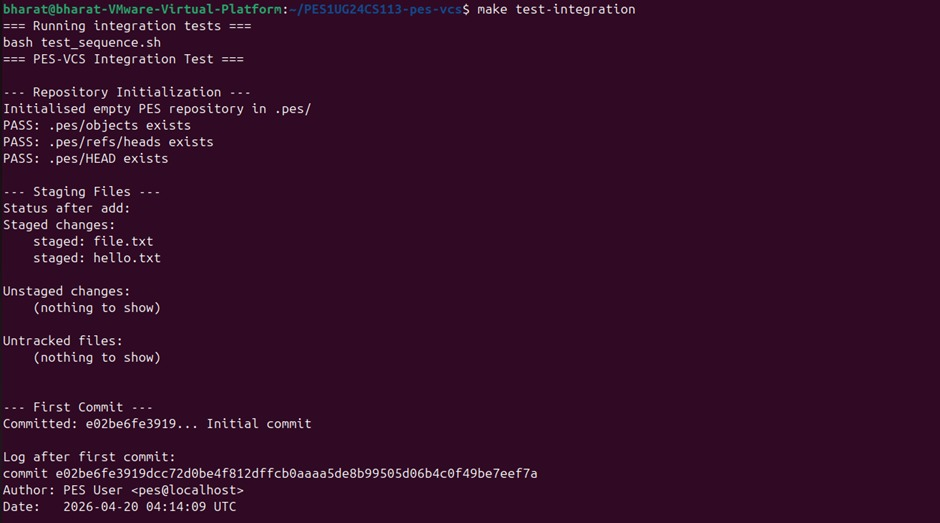
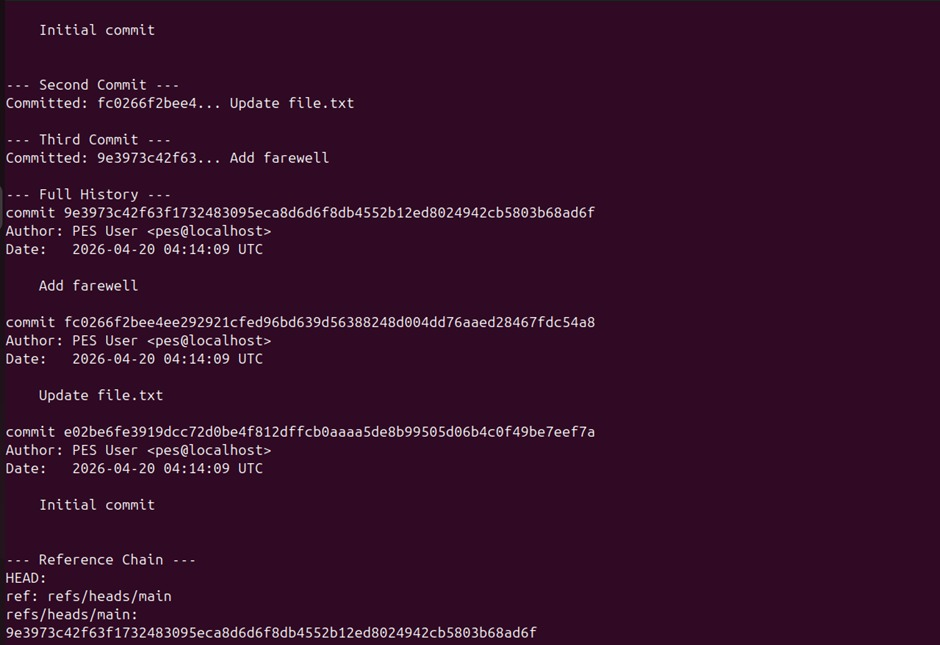
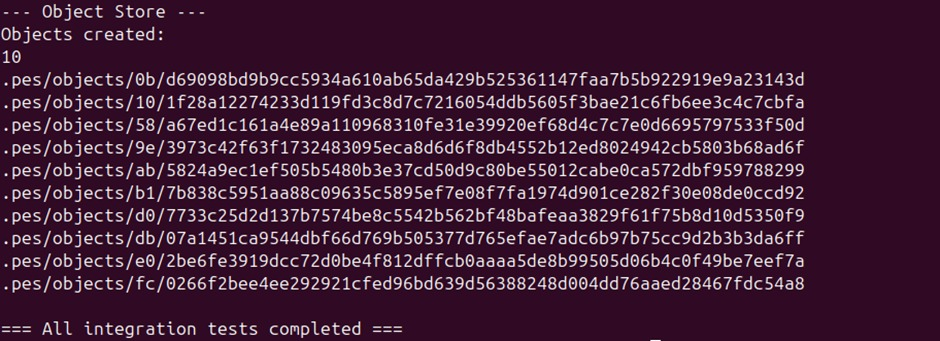

## Phase 5: Analysis

### Q5.1 - How to implement pes checkout
A branch is just a file in .pes/refs/heads/ containing a commit hash. To implement checkout:
1. Read target branch file to get commit hash
2. Read that commit to get its tree hash
3. Recursively walk the tree and write all blob contents to working directory
4. Delete files tracked in current index but absent in target tree
5. Rebuild index from target tree entries
6. Update HEAD to point to new branch

What makes it complex: uncommitted changes may conflict with target branch files, nested directories need recursive handling, and the operation must be atomic to avoid a broken state on crash.

### Q5.2 - Detecting dirty working directory conflicts
For each file in the current index:
1. Run stat() on the file and compare mtime and size with stored index values
2. If they differ, the file is dirty (modified in working directory)
3. For each dirty file, look up its hash in the target branch tree
4. If the target branch has a different hash for that file, abort checkout with an error

This uses only the index (mtime/size for dirty detection) and object store (hash comparison) with no diff engine needed.

### Q5.3 - Detached HEAD and recovery
Detached HEAD means HEAD contains a raw commit hash instead of a branch reference. Commits made in this state are not pointed to by any branch. Once you checkout another branch, those commits become unreachable and will be deleted by GC.

Recovery options:
1. Before switching: create a branch at current HEAD to save the commits
2. After switching: if you remember the hash, manually create a branch pointing to it
3. With a reflog: look up the previous HEAD positions to find the lost hash

## Phase 6: Analysis

### Q6.1 - Garbage Collection Algorithm
Mark phase: start from every branch ref, walk all commits, trees, and blobs, adding each hash to a reachable set. Use early return if hash already visited to avoid cycles.

Sweep phase: list every file in .pes/objects/, check if its hash is in the reachable set, delete if not.

Data structure: a hash set of 32-byte ObjectIDs for O(1) lookup.

For 100,000 commits and 50 branches: roughly 12 objects per commit = 1.2 million objects total. With shared history the actual unique visits would be around 500,000 to 800,000 objects.

### Q6.2 - GC Race Condition
The race: GC builds its reachable set from refs at time T1. A concurrent commit then writes new blobs and trees at T2-T3 but has not yet updated the branch ref. GC sweeps at T4, sees the new objects are not in its reachable set, and deletes them. The commit then writes its commit object and updates HEAD at T5-T6, but the blobs it references are already gone, leaving the repo corrupt.

Git avoids this by: never deleting objects newer than 2 weeks (grace period), using lock files so GC waits for commits in progress, always writing objects bottom-up (blobs before trees before commits) and updating refs last, and marking index entries as reachable to protect staged but uncommitted work.
